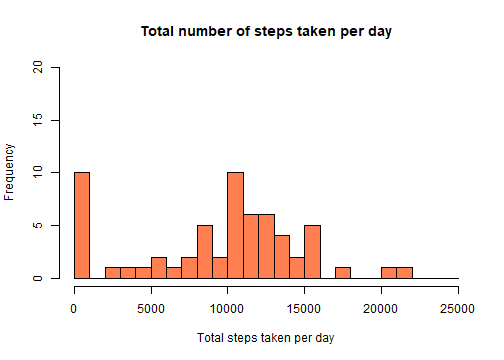
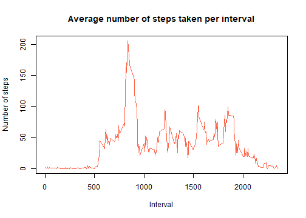
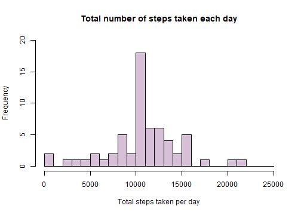
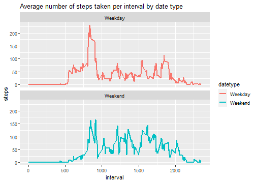

First , let's read the data

```r
data <- read.csv("data/activity.csv", header = TRUE, sep = ",")
```


Now, let's clean up and aggregate total number of steps per day 

```r
data$date <- as.Date(data$date, "%Y-%m-%d")
data_by_date <- aggregate(data$steps, by = list(data$date), sum, na.rm = TRUE)
names(data_by_date) <- c("date", "steps")
```


Here is the histogram of the total number of steps taken per day 


```r
hist(data_by_date$steps, main = "Total number of steps taken per day", 
     xlab = "Total steps taken per day", col = "coral", 
     ylim = c(0,20), breaks = seq(0, 25000, by = 1000))
```




Find the mean and median of the total number of steps taken per day, ignoring missing values 


```r
summary(data_by_date$steps, na.rm = TRUE)
```

```
##    Min. 1st Qu.  Median    Mean 3rd Qu.    Max. 
##       0    6778   10395    9354   12811   21194
```

And we found that mean is 9354 and median is 10,395. 


Now, we move on to average daily activity pattern
Here is the time series plot of the 5-min interval and average number of steps taken


```r
avg_data_by_int <- aggregate(data$steps, by = list(data$interval), mean, na.rm = TRUE)
names(avg_data_by_int) <- c("interval", "avg.steps")
plot(avg_data_by_int$interval, avg_data_by_int$avg.steps, 
     type = "l", col = "tomato1", lwd = 1, 
     main = "Average number of steps taken per interval",
     xlab = "Interval", ylab = "Number of steps")
```




Select the 5-minute interval that contains the maximum no. of steps

```r
r1 <- avg_data_by_int[which.max(avg_data_by_int$avg.steps), ]$interval 
r1
```

```
## [1] 835
```
which is 835


Now, let's examine the missing values. 
First, we calculate the total number of missing values 

```r
r2 <- sum(is.na(data))
r2
```

```
## [1] 2304
```
which turns out to be 2304


Let's fill in all the missing values using average step per interval
First, match the average step per interval with NA values in original data set and then transform the original data set using the replaced values to create a new dataset


```r
imputed_steps <- avg_data_by_int$avg.steps[match(data$interval, avg_data_by_int$interval)]
data_imputed <- transform(data, steps = ifelse(is.na(data$steps), yes = imputed_steps, no = data$steps))
```


Here is the histogram of the total number of steps taken each day 

```r
data_imputed_by_date <- aggregate(data_imputed$steps, by = list(data_imputed$date), sum)
names(data_imputed_by_date) <- c("date", "steps")
hist(data_imputed_by_date$steps, main = "Total number of steps taken each day", 
     xlab = "Total steps taken per day", col = "thistle", 
     ylim = c(0, 20), breaks = seq(0, 25000, by = 1000))
```



The mean and median total number of steps taken per day are

```r
r3 <- mean(data_imputed_by_date$steps)
r4 <- median(data_imputed_by_date$steps)
print(c(r3, r4)) 
```

```
## [1] 10766.19 10766.19
```
both 1.0766189 &times; 10<sup>4</sup> 


Now, let's see if there are any differences in activity patterns between weekdays and weekends 
Create a new factor variable, datetype, to indicate weekday and weekend 

```r
data_imputed$datetype <- weekdays(data_imputed$date)
data_imputed$datetype[data_imputed$datetype == "Saturday"] <- "Weekend"
data_imputed$datetype[data_imputed$datetype == "Sunday"] <- "Weekend"
data_imputed$datetype[data_imputed$datetype != "Weekend"] <- "Weekday"               
as.factor(data_imputed$datetype)
```


Here is the time series plot of 5-min interval and the average number of steps taken across weekday and weekend. 

```r
data_imputed1 <- aggregate(steps ~ interval+datetype, data_imputed, mean)
library(ggplot2)
g <- ggplot(data_imputed1, aes(x = interval, y = steps, color = datetype))
g <- g + geom_line(lwd = 1) + facet_wrap(~datetype, ncol = 1, nrow = 2)
g <- g + labs(title = "Average number of steps taken per interval by date type")
g
```



